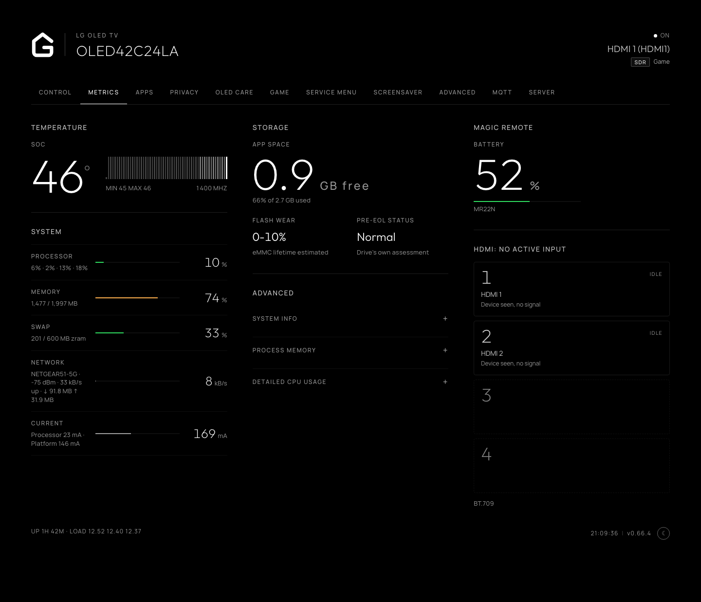
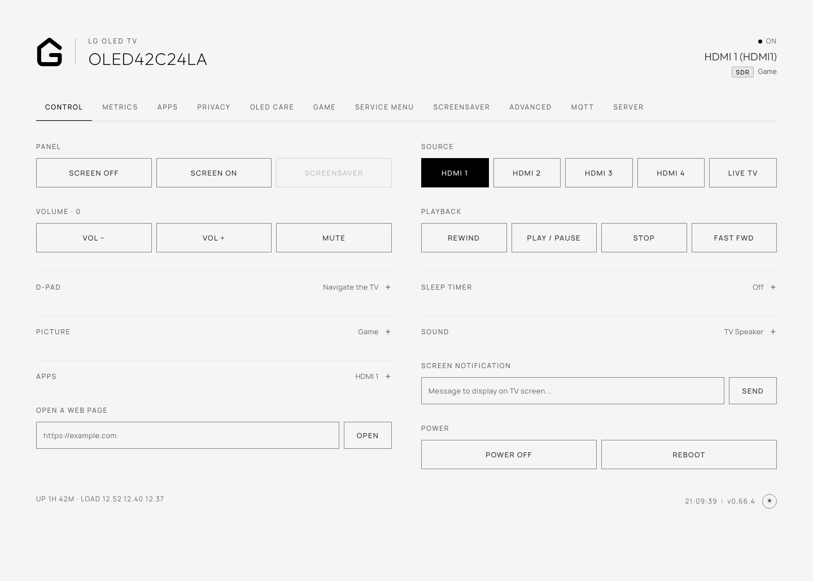
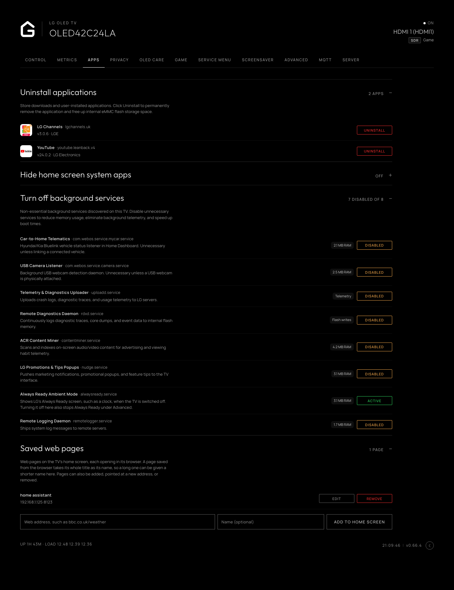
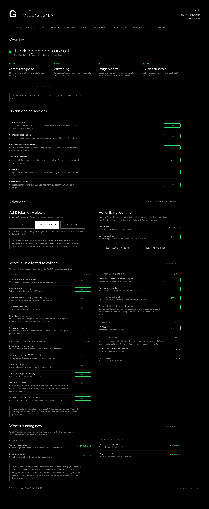
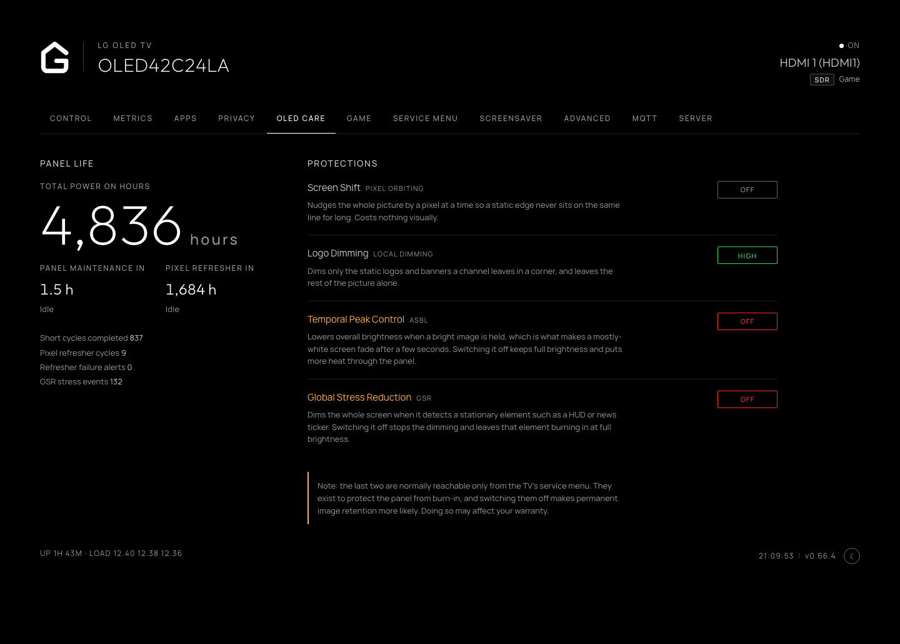
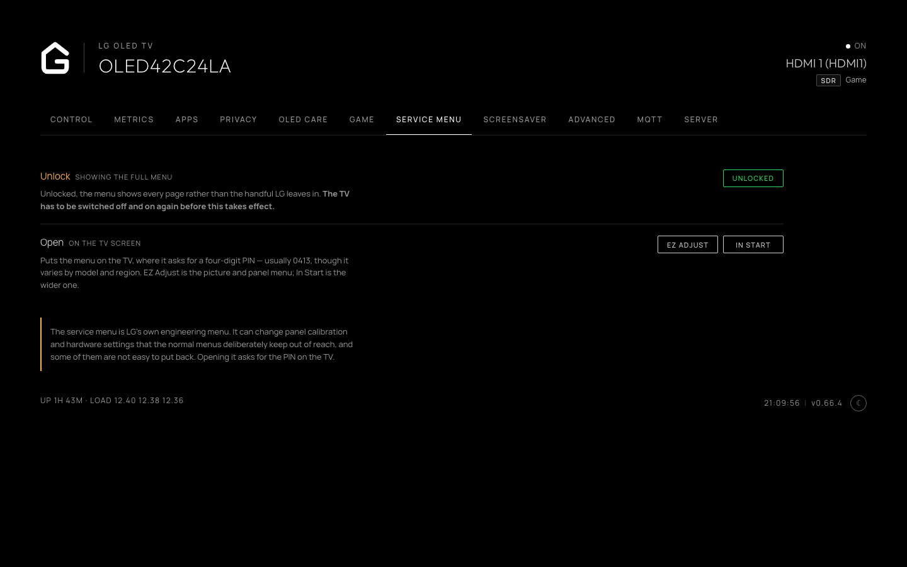
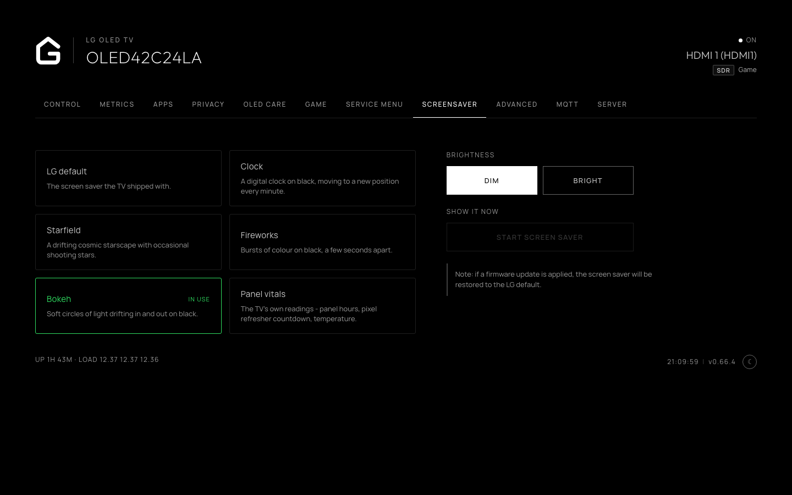
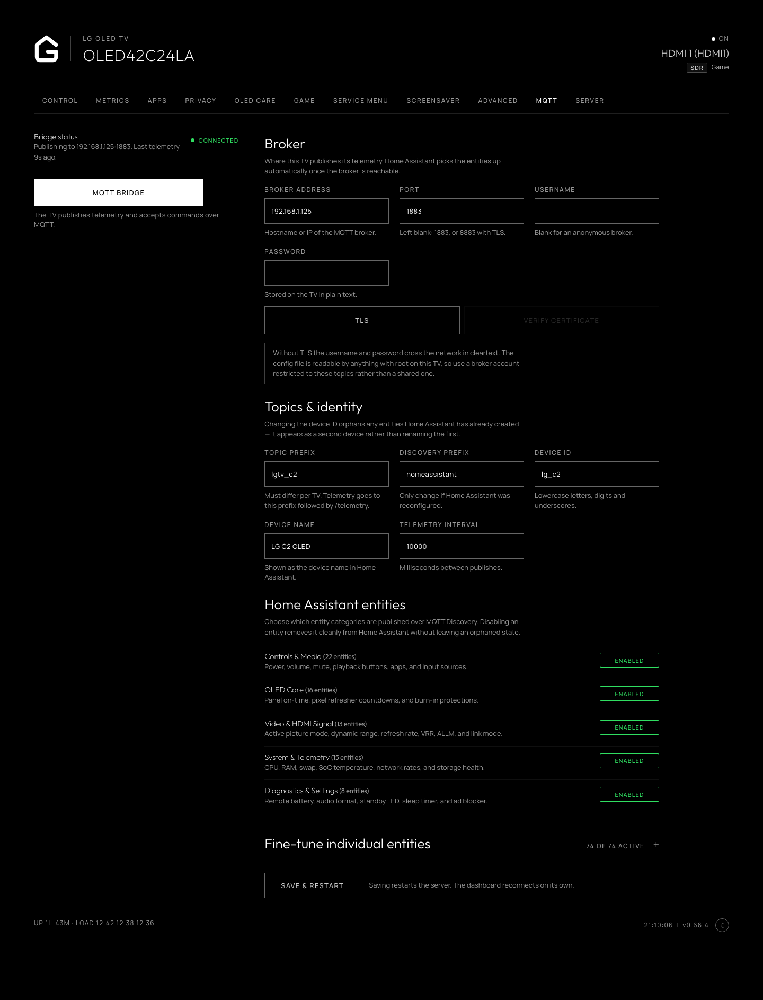

# Glasshouse

**Own the glass.** A dashboard, privacy controls and Home Assistant bridge for rooted LG webOS TVs.

> [!NOTE]
>
> ## You bought the TV.
>
> **You control the TV. You own the glass.**
>
> The philosophy behind this project is simple: **ownership should include meaningful control.**
> A TV should remain useful and controllable by its owner, rather than
> being treated primarily as a platform for services, telemetry and vendor-controlled
> experiences.
>
> This project brings control, visibility and automation back to the device.
> Local, transparent, and without requiring a manufacturer cloud service.
> No nonsense, no data collection, no ads, no dark patterns. I don't want your data.

**glasshouse** is a server that runs directly on a rooted LG webOS TV, providing both a live browser dashboard and a dashboard app.

Use it for remote control, app management and removal, OLED panel care, privacy controls, service menu access, and hardware telemetry. It also includes an MQTT bridge for integrating the TV with Home Assistant and other smart-home software.

### Compatibility at a glance

* **webOS**: 3.4 through 25 confirmed; tested across 2016–2025 models. Other versions likely work as well
* **Panels**: OLED (full panel wear telemetry and burn-in controls) and LCD (core dashboard, controls, and telemetry; OLED Care tab hides automatically)
* **Access**: Rooted via [Homebrew Channel](https://github.com/webosbrew/webos-homebrew-channel). Telnet or SSH. No external dependencies or internet access needed on the TV
* **Tested hardware**: 17 models verified so far (UH6030, UH610V, B7, B8, C8, C9, C1, QNED82, C2, B4, G4, UT81, C5, CS). Other rooted models should work; [see full table](#tested-tvs)

[Quick start](#quick-start) • [What it's for](#what-its-for) • [Screenshots](#screenshots) • [Features](#features) • [Installation](#installation) • [Tested TVs](#tested-tvs) • [Home Assistant](#home-assistant--mqtt) • [Managing the server](#managing-the-server) • [Security](#security)

---

## Quick start

1. Root the TV and install the [Homebrew Channel](https://github.com/webosbrew/webos-homebrew-channel).
2. Clone this repository on a computer on the same network as the TV.
3. Run `./deploy.sh <tv-ip>` from the `server/` directory.
4. Open `http://<tv-ip>:8080/` in a browser.

That's it. The dashboard is ready to use.

For compatibility, screenshots, the full feature list, troubleshooting and configuration details, continue below.

---

## What it's for

This project is intended to give a rooted webOS TV a useful local control surface instead of requiring the owner to work around the TV's built-in menus, vendor services and cloud dependencies.

1. **[Controlling the TV without the cloud](#remote-control).** A D-pad to navigate the TV itself, volume, mute, media playback keys (play, pause, stop, skip), app launcher, picture presets, sound output routing, power and reboot.

2. **[Seeing what the TV is configured to collect, and switching it off](#privacy-and-data-collection).** Whether LG's content-recognition engine is running and sampling your screen, your advertising identifier and whether ad tracking is limited, and every data agreement recorded on the TV with most of them switchable from the dashboard. Includes an on-TV blocker for LG's ad and telemetry endpoints, and a switch for the two diagnostics services that upload to LG.

3. **[App management, debloating and home screen cleanup](#apps-and-home-screen-launcher).** Permanently uninstall apps to reclaim internal flash storage, disable unnecessary background system services to free up RAM and CPU cycles, and hide non-removable built-in LG system apps from the home launcher.

4. **[Replacing the screen saver](#screen-savers).** A clock, a starfield, fireworks, or the TV's own readings, each dim or bright, in place of LG's.

5. **[Integrating the TV with your smart home](#home-assistant--mqtt).** The MQTT bridge exposes the TV as a single device with its controls and telemetry, with Home Assistant support through MQTT Discovery and the same underlying interface available to other MQTT clients.

6. **[Seeing what the TV is actually doing](#telemetry-and-diagnostics).** SoC temperature, per-core CPU load, memory, swap, current draw, Wi-Fi signal and throughput.

7. **[Observing OLED panel wear](#oled-wear-and-burn-in-protection).** Cumulative panel hours, compensation cycle progress, Pixel Refresher countdown with scheduling, completed cycle counters and refresher failure alerts.

8. **[Controlling the OLED burn-in protections](#oled-wear-and-burn-in-protection).** What each one does and a switch for it: screen shift and logo dimming on any OLED, and on TVs that expose them, ASBL and Global Stress Reduction (normally reachable only from the TV's service menu, with a service remote and a PIN).

9. **[Opening the service menu, and unlocking it where it is locked](#service-menu-access).** LG's own engineering menu, put on the TV screen from a browser which means no service remote is needed. Newer firmware shows a cut-down version of it until it is unlocked, which the dashboard can do as well.

10. **[Reading all of it on the TV itself](#the-dashboard-on-the-tv).** An optional app on the home screen puts the same readings and controls on the TV, driven by the remote, for when there is no phone or laptop to hand.

---

## Screenshots

### Web dashboard

<p align="center">
  <a href="docs/screenshots/dashboard.png"></a>
  &nbsp;
  <a href="docs/screenshots/dashboard-light.png"></a>
  <br>
  <sub>System and Control tabs, shown in dark and light themes.</sub>
</p>

### Home Assistant

The TV arrives over MQTT Discovery as a single unified device:

<p align="center">
  <a href="https://github.com/user-attachments/assets/1d76b1a2-68d9-42a4-a497-b107d706b235"></a>
  <br>
  <sub>MQTT Discovery entities exposed by the TV.</sub>
</p>

A custom Home Assistant dashboard for an LG TV:

<p align="center">
  <a href="https://github.com/user-attachments/assets/737b3106-e8a4-4c6b-ba96-b0bad130b600"></a>
  <br>
  <sub>A custom Home Assistant dashboard using the TV's MQTT entities.</sub>
</p>

---

## Features

Each has a tab of its own in the dashboard, and a deep link to it. OLED Care appears on OLED TVs only. The page works with no internet access, and has a dark/light mode toggle (via the UI or `/?theme=light`).

### Remote control

The **Control** tab, `/?tab=control`, turns the TV itself into a locally controlled device. Instead of relying on LG's cloud services or a phone app, the dashboard talks directly to webOS over the local network.

From a browser you can navigate the TV, change inputs, control playback and volume, launch applications, change picture and sound settings, blank the screen, set a sleep timer, and send notifications.

* A D-pad — arrows, OK, Back and Home — to navigate the TV's own interface.
* Volume, mute, input select, and media playback — play, pause, stop, skip.
* App launching, picture presets and sound output routing. The presets on offer are the ones the TV will accept for whatever is playing: a Dolby Vision source has its own presets.
* Screen blanking, sleep timer, on-screen notifications, and power and restart.
* Opening a web page on the TV: type an address and the TV's browser takes it.

The **Advanced** tab, `/?tab=advanced`, holds the TV's own settings that LG keeps several menus deep: Quick Boot, Wake-on-LAN, the LG logo shown at power on and off, and the front lights. Each setting appears only on TVs that have it. On the TV itself they are under **System**.

### Telemetry and diagnostics

The **Metrics** tab, `/?tab=metrics`, exposes information about what the TV is doing and what hardware it contains — most of which is absent from its own settings menu.

This is useful both for monitoring and for troubleshooting. You can see whether a high-temperature condition is accompanied by CPU load, what Wi-Fi signal the TV actually has, what HDMI mode a connected device negotiated, and what software is currently running.

* SoC temperature and current draw, CPU and per-core load, GPU clock, memory and swap, Wi-Fi RSSI and network throughput.
* eMMC flash wear with JEDEC health translation, and free space on the app partition.
* HDMI link state per port, refresh rate, colour depth, pixel clock, and HDMI 2.1 diagnostics where supported (link rate, chroma format, HDCP version, cable error counter, ALLM, VRR, QMS and colorimetry).
* Dolby Vision / HDR / SDR detection, picture mode, OLED light level, the raw HDMI signal (`3840x2160 @ 120Hz`), audio output routing, and the running app with friendly input names (`Apple TV (HDMI2)`).
* Magic Remote battery and model; webOS and firmware version, SoC architecture, OLED cell ID and TCON firmware where the platform exposes them.
* On demand: what is resident in memory, and which processes are using the processor right now.

<p align="center">
  
  <br>
  <sub>Metrics including processor, memory, swap and current draw.</sub>
</p>

### Apps and home screen launcher

The **Apps** tab, `/?tab=apps`, gives you three different ways to manage software on the TV.

**Uninstall** removes an application completely and frees its storage. **Disable** stops selected background services without deleting them. **Hide** removes built-in LG system apps from the home launcher without touching the underlying application.

* **Uninstall applications:** Store downloads and sideloaded packages with version and vendor details, and a one-click uninstall action to permanently delete apps and free up internal eMMC flash storage.
* **Turn off background services:** Safely disable unnecessary background services and daemons that consume RAM and CPU cycles (such as USB camera watcher, Connected Car listeners, and browser preloading). Only services actually present on your TV model are displayed, and disabled states are persisted across reboots.
* **Hide home screen system apps:** Hide non-removable LG system apps (Gallery, Music, Sports, Always Ready, Camera, User Guide, Device Connector, Alexa, Google Assistant, etc.) from the home launcher ribbon. Operates non-destructively via reversible `appinfo.json` bind-mounts. Includes a master toggle to instantly return to stock behavior.
* **Strict system safeguards:** Core TV services (`Live TV`, `Settings`, `Launcher`, input switchers, and the dashboard itself) are strictly protected and can never be hidden or uninstalled.
* **Available on TV and Web:** Manage apps from any browser or directly on the TV using the remote control in the on-TV dashboard app.

<p align="center">
  <a href="docs/screenshots/apps.png"></a>
  <br>
  <sub>Installed applications, background services and built-in system apps.</sub>
</p>

### Privacy and data collection

The **Privacy** tab, `/?tab=privacy`, reports what the TV is configured to do rather than hiding these settings behind its normal menus.

It opens with a summary of screen recognition, ad tracking and usage reports, what is still on under each, and a button that switches all of it off while leaving voice and LG Channels alone. Everything below it is the detail.

It shows whether the content-recognition engine is running and sampling frames, your advertising ID and whether ad tracking is limited, recorded data agreements, and toggles to disable LG's background collection and diagnostics services.

Most data agreements can be switched off from here (persisting across reboots), and the advertising ID can be reset and its cookies cleared. Acceptance of new terms is left to the TV's own menus.

The ad & telemetry blocker blackholes LG's tracking, ad and ACR endpoints on the TV itself, by bind-mounting a hosts table over `/etc/hosts`, and is restored on boot.

Two tiers are available:

* **ads & telemetry** blocks LG's ad, diagnostics and customer-data hosts and the Alphonso screen recognition servers, and leaves LG's service platform reachable.
* **everything** adds the hosts that carry the Content Store and firmware delivery, so on that tier the app store and updates may stop working.

What ACR collects and what LG Ad Solutions does with it is set out in [What LG's ACR does](docs/ACR.md).

<p align="center">
  <a href="docs/screenshots/privacy.png"></a>
  <br>
  <sub>Privacy controls, data agreements, advertising ID and LG telemetry blocking.</sub>
</p>

### OLED wear and burn-in protection

The **OLED Care** tab, `/?tab=oledcare`, brings together the panel's own wear figures with the protections that affect OLED wear.

The aim is not to encourage disabling OLED protections blindly. Instead, the dashboard shows what each control does and exposes the controls that the particular panel makes available.

* Cumulative panel hours, panel maintenance and Pixel Refresher countdowns with scheduling, completed cycle counters and refresher failure alerts.
* GSR stress events on supported panels — counts how many times static elements (such as logos, HUDs, or news tickers) triggered active panel dimming to prevent burn-in.
* Screen shift and logo dimming on any OLED.
* Temporal peak control (ASBL) and global stress reduction on supported models (the two normally reachable only from the TV's service menu, with a service remote and a PIN).

<p align="center">
  <a href="docs/screenshots/oledcare.png"></a>
  <br>
  <sub>OLED panel wear information and burn-in protection controls.</sub>
</p>

<p align="center">
  
  <br>
  <sub>Panel life, maintenance and Pixel Refresher status.</sub>
</p>

### Service menu access

The **Service menu** tab, `/?tab=servicemenu`, opens LG's engineering menu on the TV — EZ Adjust or In Start — without a service remote; the TV still asks for its PIN.

Newer firmware shows a cut-down version until it is unlocked, and the dashboard can unlock it. The TV has to be switched off and on again before that takes effect. TVs old enough not to lock it say so.

> [!WARNING]
> The service menu provides low-level hardware and calibration control. Changing unfamiliar values in EZ Adjust or In Start can cause permanent display corruption or render the TV unbootable.

<p align="center">
  <a href="docs/screenshots/servicemenu.png"></a>
  <br>
  <sub>Service menu access, unlock state and low-level hardware controls.</sub>
</p>

### Screen savers

The **Screensaver** tab, `/?tab=screensaver`, provides four alternatives to LG's default:

* Clock
* Starfield
* Fireworks
* Panel vitals, showing the TV's own panel hours and refresher countdown

Each mode offers dim and bright variants, and visual elements continuously drift across the screen to prevent OLED burn-in or image retention.

A firmware update restores the LG default.

<p align="center">
  <a href="docs/screenshots/screensaver.png"></a>
  <br>
  <sub>Built-in screen saver choices, including the panel-vitals display.</sub>
</p>

<p align="center">
  <a href="docs/screenshots/screensaver-starfield.png"></a>
  <br>
  <sub>The Starfield screen saver with continuously moving elements.</sub>
</p>

### The dashboard on the TV

The dashboard can also run directly on the TV's home screen, driven by the remote, for when there is no phone or laptop to hand.

A first install adds it; updating an existing one leaves the home screen alone. It can be added or removed at any time from the **Server** tab, which is also where it turns up for anyone who updated in place rather than re-running the installer.

Removing it changes nothing else, since the dashboard reaches any browser on the network regardless. Where a TV will not take the app, the control is hidden and everything else works as before.

### Home Assistant and MQTT

The **MQTT** tab, `/?tab=mqtt`, publishes the TV to an MQTT broker, where it arrives in Home Assistant as a single auto-discovered device.

The tab holds the broker address, credentials, topic prefix and device identity, with the bridge's connection state and last publish time beside them.

[Home Assistant & MQTT](#home-assistant--mqtt) covers the setup.

### Server updates

The **Server** tab, `/?tab=server`, shows the installed version, whether a newer release is out, and buttons to install it or roll back to the version before.

**Check daily** looks on its own and lets Home Assistant offer the update.

It also adds or removes [the app on the TV's home screen](#the-dashboard-on-the-tv).

[Updating](#updating) covers installs from before the tab existed.

---

## Installation

### Requirements

* A rooted LG webOS TV ([Root tool here](https://github.com/throwaway96/dejavuln-autoroot/)) with the [Homebrew Channel](https://github.com/webosbrew/webos-homebrew-channel).
* A computer on the same network to install from: a Mac, a Linux machine, or a Windows PC. The installation uses Git and requires no other software on the computer. The TV does not need internet access.

If you want to use the MQTT bridge, you will also need an MQTT broker on the network. Home Assistant's Mosquitto add-on is one option, but any compatible MQTT broker works.

### Tested TVs

Tested across the following TVs so far. The Luna service names and `/proc/lg` paths this relies on may differ across webOS versions and panel types.

| Model       | webOS        | Firmware | Panel | Notes                                                          |
| :---------- | :----------- | :------- | :---- | :------------------------------------------------------------- |
| 43UH610V-ZB | 3.4.3        | 05.70.50 | LCD   | No SoC temp, eMMC wear, or OLED metrics by hardware design     |
| 55UH6030-UC | 3.4.3        | —        | LCD   |                                                                |
| OLED65B7V-Z | 3.9.3        | 06.10.65 | OLED  | No SoC temperature or eMMC wear readings                       |
| OLED65C8PUA | 4.4.0        | 05.50.15 | OLED  | No `getAdid` on this firmware                                  |
| OLED65B8SLC | 4.4.3        | 05.50.70 | OLED  | Everything works. Misses a few metrics found on newer versions |
| OLED55C9PLA | 4.9.0        | 05.30.40 | OLED  | Working fine                                                   |
| OLED65C9AUA | 4.9.x (4.5+) | 05.50.00 | OLED  |                                                                |
| OLED55C17LB | 6.x          | —        | OLED  | HDMI 2.1 diagnostics and remote battery reporting              |
| OLED55C1PUB | 6.x (6.3+)   | 03.53.45 | OLED  | SSH install and MQTT bridge confirmed                          |
| 55QNED826QB | 7.6.0        | 04.60.90 | LCD   | Installed over SSH; MQTT bridge confirmed                      |
| OLED42C24LA | 9.2.2 (22+)  | 23.25.55 | OLED  | Rooted with jsbro-autoroot                                     |
| OLED55B46LA | 24 (9.24.8)  | 23.23.30 | OLED  | Installed over telnet                                          |
| OLED55G42LW | 24           | 33.31.68 | OLED  | Rooted with slopbro, not the Homebrew Channel                  |
| 50UT81006LA | 25 (10.2.1)  | 33.22.56 | LCD   | Partial: blocking works; some settings reported not to apply   |
| OLED65CSPSA | 25 (10.3.0)  | 33.31.20 | OLED  | Reported working                                               |
| OLED48C55LA | 25 (10.3.1)  | 33.31.68 | OLED  | Installed over telnet; in-app update to 0.37.2 confirmed       |
| OLED77C57LA | 25 (10.3.1)  | 33.31.68 | OLED  | MQTT, privacy, screen saver and web dashboard confirmed        |

**Tested on another model?** Please [open an issue](https://github.com/rorygallagher2024/lg-webos-dashboard/issues/new) with your TV model, webOS version, and the contents of `/var/lib/tvweb/tvweb.log` — whether everything worked or something broke — and we will add a row.

### 1. Get the files

> [!TIP]
> **Git is required.** On Windows, install [Git for Windows](https://git-scm.com/download/win), which also provides the Git Bash window used by the commands below. macOS and most Linux distributions already include Git or make it available through their standard package manager.

Download the project onto a computer on the same network as the TV.

```bash
git clone https://github.com/rorygallagher2024/lg-webos-dashboard.git
cd lg-webos-dashboard/server
```

### 2. Install the dashboard

Find the TV's address under Settings → Network on the TV, or in the router's list of devices. The installer automatically uses SSH if the TV has it, and falls back to the Homebrew Channel's telnet if not.

> [!CAUTION]
> Telnet leaves an unauthenticated root shell open on your local network.
> [Moving from telnet to SSH](docs/SECURITY.md#moving-from-telnet-to-ssh)
> takes about five minutes and is strongly recommended.

Then, from the `server/` directory in your terminal:

```bash
./deploy.sh <tv-ip>
```

For example, `./deploy.sh 192.168.1.50`. It takes about ten seconds and finishes by checking that the dashboard answers. When it says `done`, open **`http://<tv-ip>:8080/`** in a browser. If anything goes wrong, it stops and says why.

A first install also adds the dashboard to the TV's home screen as an app, so it can be opened on the TV itself with the remote — see [The dashboard on the TV](#the-dashboard-on-the-tv).

It can be removed again from the dashboard at any time. Updating an existing install leaves the home screen exactly as it is, so a removed app never comes back on its own.

`--no-app` skips it on a first install, and `--app` adds it to an existing one.

The server starts again by itself whenever the TV restarts. To try it without that, add `--no-persist`, and it runs only until the TV next restarts. Setting the router to always give the TV the same address saves looking it up again.

No configuration is needed for this part. Without a config file the dashboard runs on port 8080, the controls are live, MQTT is off, and power off / reboot are disabled.

Nothing is sent anywhere: the server talks to the TV and to whoever opens the page, and reaches the internet only to look for a new release — when the dashboard's Server tab is opened, or daily if [checking automatically](#checking-automatically) is switched on.

### Troubleshooting

* **Connection refused or password prompt during install.** The installer tries passwordless SSH first, then telnet. If SSH prompts for a password, make sure telnet is toggled **ON** in the TV's Homebrew Channel app settings, or run `./deploy.sh <tv-ip> --telnet` to connect directly over telnet.
* **Nothing on port 8080.** On the TV, `/var/lib/tvweb/tvwebctl status` says whether the server is running and `/var/lib/tvweb/tvweb.log` says why it is not.
* **Panel hours and OLED Care missing on an OLED TV**, or showing on an LCD one. Panel detection went the wrong way: set `"panel": "oled"` or `"panel": "lcd"` in `server/config.json` before a first deploy, or in `/var/lib/tvweb/config.json` on a TV that already has one.

---

## Home Assistant & MQTT

### What these are

**MQTT** is a lightweight messaging protocol: a device publishes state updates to a named topic, and any subscriber instantly receives them. It relies on a **broker** — a small server that relays those messages between publishers and subscribers. [Mosquitto](https://mosquitto.org/) is the usual one, and Home Assistant ships it as a one-click add-on.

This project publishes the TV's telemetry to a broker, and describes its own entities using the **MQTT Discovery** convention. Home Assistant reads that description and creates the device with all its sensors and controls by itself.

There is no YAML to write.

Home Assistant is one consumer of the MQTT interface. Other MQTT clients can subscribe to the same topics, including Node-RED, Telegraf, scripts and other automation systems.

### Setting it up from the dashboard

Open the dashboard, then the **MQTT** tab. Fill in the broker address and credentials, switch **MQTT bridge** on, and save.

The server writes `config.json` on the TV and restarts itself; the page reconnects on its own after a few seconds.

Home Assistant picks up the device within a few seconds of the bridge connecting.

<p align="center">
  <a href="docs/screenshots/mqtt.png"></a>
  <br>
  <sub>MQTT bridge configuration and connection status.</sub>
</p>

The panel reports whether the bridge is connected to the broker and how long ago it last published, so a wrong address or a rejected password shows up there rather than in the log on the TV.

### Setting it up from a config file

Equivalent to the above, and the better route for installing several TVs from one machine or for keeping the settings under version control.

From `server/`, where step 1 left off:

```bash
cp ../config.example.json config.json
```

Set the broker under `mqtt` and set `enabled` to `true`, then run `./deploy.sh <tv-ip>` again.

Leaving `device.name` and `device.model` empty makes the TV report its own model and firmware at runtime.

`deploy.sh` only installs this file if the TV does not already have one, so it will not overwrite settings saved from the dashboard.

To replace an existing config, edit it through the dashboard or remove `/var/lib/tvweb/config.json` first.

<details>
<summary><strong>Which settings live where?</strong></summary>

The dashboard can change the broker, credentials, topic prefix and device identity — the things that decide *where* telemetry goes.

`port`, `host`, `allowControl`, `allowPower` and `token` are file-only. They decide *who can reach the server at all*, and a web UI able to widen its own exposure would defeat the point of setting them.

Edit those in `config.json` and redeploy, or edit `/var/lib/tvweb/config.json` on the TV and restart.

`allowPower` ships disabled, because there is no authentication unless `token` is set — a fresh install should not expose "turn the TV off" to the whole network. Enable it deliberately.

> [!NOTE]
> Give the TV its own MQTT user with a restricted topic ACL rather than reusing your main Home Assistant credentials. See [docs/SECURITY.md](docs/SECURITY.md).

</details>

### Using MQTT without Home Assistant

The bridge is a plain MQTT publisher, so anything that speaks MQTT can read it.

Telemetry is published as JSON to `<topicPrefix>/telemetry`, availability to `<topicPrefix>/status`, and commands are accepted on `<topicPrefix>/command/*`.

```bash
mosquitto_sub -h <broker> -t 'lgtv/#' -v
```

Node-RED, Telegraf into InfluxDB, or a script subscribing to that topic all work the same way. The Discovery messages are simply ignored by anything that is not Home Assistant.

### Multiple TVs

Each TV on the same broker needs a unique `topicPrefix` and `device.id`, otherwise they overwrite each other's state and disconnect each other.

Both are editable from each TV's own dashboard.

For the config-file route, `deploy.sh` checks for `server/config.<tv-ip>.json` before falling back to `server/config.json`, which keeps per-TV settings from being flattened by a shared file.

<details>
<summary><strong>Running one half without the other</strong></summary>

|                            | `web.enabled` | `mqtt.enabled` |
| :------------------------- | :------------ | :------------- |
| Dashboard and MQTT         | `true`        | `true`         |
| Dashboard only *(default)* | `true`        | `false`        |
| MQTT only                  | `false`       | `true`         |

With the dashboard disabled the server is an MQTT bridge with no web interface, which is the safer shape if everything is driven from an MQTT client — the dashboard is an unauthenticated control endpoint unless `token` is set.

Note that this also removes the settings UI, so an MQTT-only install is configured by file.

With both disabled the server exits rather than idling.

</details>

See [docs/HOME-ASSISTANT.md](docs/HOME-ASSISTANT.md) for the entity list and example automations.

---

## Managing the server

```bash
ssh root@<tv-ip> /var/lib/tvweb/tvwebctl status    # start | stop | restart | status
```

### Updating

How depends on the install. One with a **Server** tab in its dashboard updates itself; an older one is updated by deploying again, after which it has the tab.

**With the Server tab.** Opening it looks for a newer release, and **Check now** looks again. **Install** puts it on and restarts the server, and **Roll back** returns to the version it replaced.

Home Assistant can offer the same install while the [daily check](#checking-automatically) is on.

Over SSH:

```bash
ssh root@<tv-ip> /var/lib/tvweb/tvwebctl update           # install the latest release
ssh root@<tv-ip> /var/lib/tvweb/tvwebctl update --check   # report without installing
ssh root@<tv-ip> /var/lib/tvweb/tvwebctl rollback         # put the previous version back
```

**Without it, or for something unreleased,** pull the latest code into the clone from [step 1](#1-get-the-files) and deploy again, with the flags used the first time:

```bash
cd lg-webos-dashboard/server
git pull
./deploy.sh <tv-ip>
```

Only the server's own files are replaced: your configuration, ad blocker hosts, screen saver, and stopped services are preserved.

Previous versions are saved to allow instant rollback via `tvwebctl rollback`.

See [docs/IMPLEMENTATION.md](docs/IMPLEMENTATION.md#in-place-updater-and-binary-probing) for client probing order and manual rollback details.

### Checking automatically

Off by default, because it reaches off the LAN without anyone asking.

**Check daily** in the Server tab switches it on, as does `config.json`:

```json
{ "update": { "check": true, "intervalHours": 24 } }
```

With it on, the server asks GitHub for the latest release once a day, the dashboard footer shows a newer version next to the installed one, and Home Assistant gets the update entity.

The request says nothing about the TV beyond the address any HTTP request reveals.

### Uninstalling

```bash
ssh root@<tv-ip>
/var/lib/tvweb/tvwebctl stop
rm -rf /var/lib/tvweb
rm -f /var/lib/webosbrew/init.d/50-tvweb* /var/lib/webosbrew/init.d/20-tvweb-services /var/lib/webosbrew/init.d/20-services.sh
rm -f /var/lib/webosbrew/tvweb-boot.log*
```

Nothing on the TV's read-only rootfs is ever modified. [What the dashboard changes on the TV](docs/TV-CHANGES.md) lists everything else, including the settings that uninstalling leaves as they are.

---

## Security

The dashboard binds to `0.0.0.0` with **no authentication by default**, allowing frictionless control from any phone or browser on your trusted local network.

**Never expose port 8080 directly to the internet (do not port-forward).**

To narrow it, set one of these in `config.json` and restart the server:

| Setting                        | Browser on the network                  | App on the TV | MQTT  |
| :----------------------------- | :-------------------------------------- | :------------ | :---- |
| `"token": "your-secret-token"` | with `?k=your-secret-token`             | works         | works |
| `"host": "127.0.0.1"`          | no — port 8080 is closed to the network | works         | works |
| `"web": { "enabled": false }`  | no                                      | does not work | works |

`"host": "127.0.0.1"` is the one to use to keep the on-TV app while closing the port to everything else.

The app runs on the same server, so switching the web server off entirely leaves its tile with nothing to open — remove it from the **Server** tab first; a first install with the web server off does not add it.

The MQTT settings panel is part of that surface: on a default install, anyone who can reach the port can change the broker the TV publishes to, and so redirect its telemetry.

It is gated by `token` and by `allowControl` like the rest of the controls, and it cannot change `port`, `host`, `allowControl`, `allowPower` or `token` themselves — those stay file-only so the UI cannot widen its own exposure.

The stored broker password is never sent to the browser.

Setting a token affects the dashboard only. MQTT is a separate channel.

Full detail, including the MQTT ACL guidance and optional TLS, is in [docs/SECURITY.md](docs/SECURITY.md).

---

## Documentation

* [docs/SECURITY.md](docs/SECURITY.md) — threat model, SSH migration, MQTT hardening
* [docs/HOME-ASSISTANT.md](docs/HOME-ASSISTANT.md) — the entity reference, universal media player, example automations
* [docs/IMPLEMENTATION.md](docs/IMPLEMENTATION.md) — architecture, `/proc/lg` reference, platform quirks

---

## Disclaimer

**Use this software at your own risk.**

* **Root access and hardware.** This runs custom software with `root` privileges on an embedded TV OS. It is designed to be lightweight and to leave the read-only rootfs untouched, but the authors accept **no responsibility** for damage, bootloops, bricked devices, voided warranties, data loss or OLED panel issues.
* **Power and control commands.** Reboot, power off, screen blanking and Pixel Refresher scheduling issue low-level `luna-send` calls. Understand what each does before using it.
* **Trademarks.** An independent, unofficial community project, not affiliated with or endorsed by LG Electronics. webOS is a trademark of LG Electronics.
* **Fonts.** Bundles [Outfit](https://github.com/Outfitio/Outfit-Fonts) and [Manrope](https://github.com/sharanda/manrope) under the [SIL Open Font License 1.1](https://openfontlicense.org/); licence texts ship in `server/assets/fonts/`.

## License

MIT. See [LICENSE](LICENSE).
